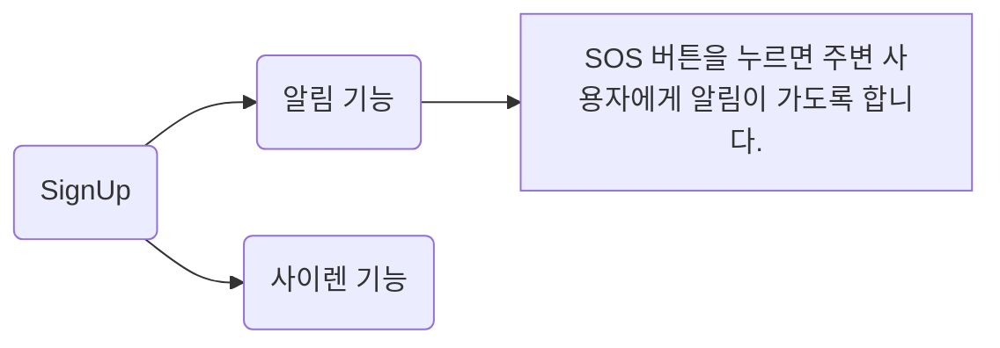

> 안드로이드 기반의 밤길안전어플 moonlightfariy입니다.
> moonlightfairy가 이루고자 하는 목표의 키워드는 범죄 예방, 편의성, 공공성입니다.

## 팀원
김나연, 김미경, 김아현, 백예림, 최효빈

## 개발도구

firebase

android

## 주 기능

-   로그인
-   알림 기능
    -   SOS 버튼을 누르면 주변 사용자에게 알림이 가도록 합니다.
-   사이렌 기능